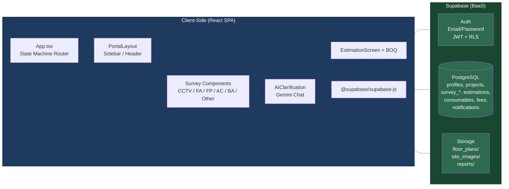
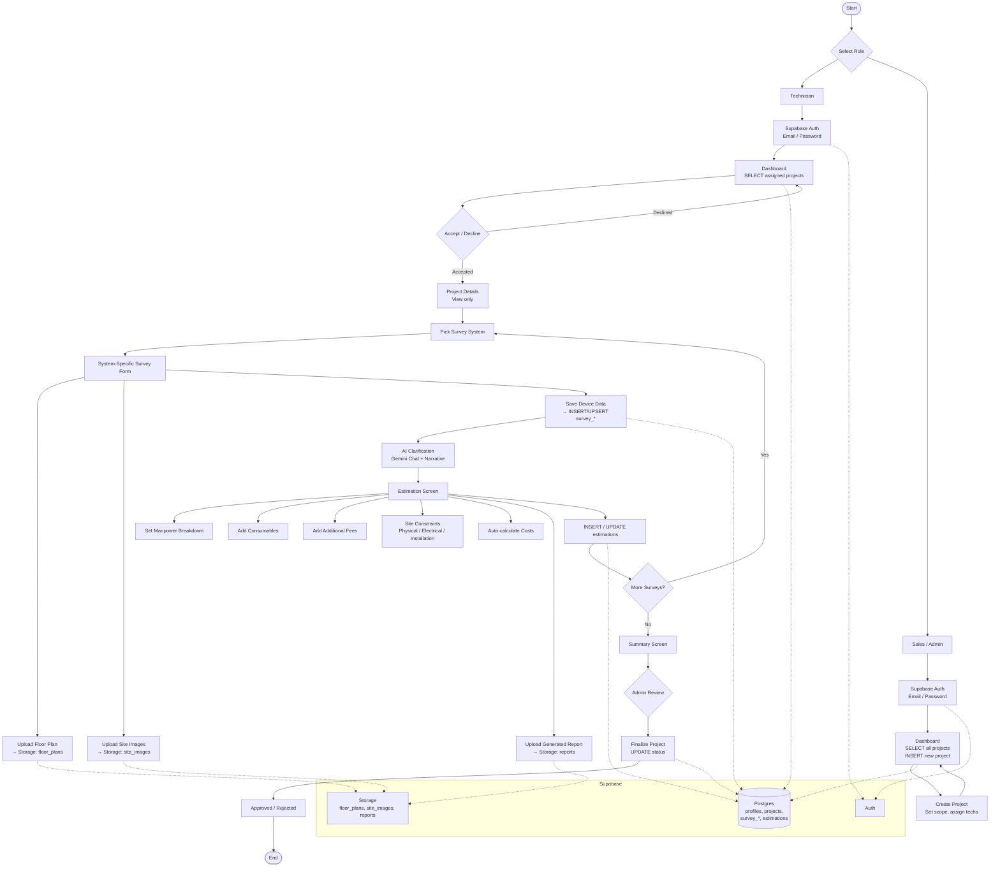

# AA2000 Site Survey

Site survey and estimation platform for electronic security systems (CCTV, Fire Alarm, Access Control, Burglar Alarm, Fire Protection, and more). Built with React + TypeScript on the frontend and Supabase as the backend.

## Tech Stack

| Category | Technology |
|----------|-----------|
| Framework | React 19, TypeScript |
| Build | Vite 6 |
| Styling | Tailwind CSS 4, Framer Motion |
| Backend | Supabase (Auth, Postgres, Storage, Edge Functions) |
| AI | Google Gemini (@google/genai) |
| Documents | jsPDF, html2canvas, docx |
| Maps | Leaflet |

## Prerequisites

- Node.js 18+
- A Supabase project (create one at [supabase.com](https://supabase.com))
- A Google Gemini API key ([get one here](https://aistudio.google.com/apikey))
- (Optional) A Groq API key for floor-plan analysis ([console.groq.com](https://console.groq.com))

## Getting Started

1. **Clone the repo**

2. **Install dependencies**
   ```bash
   npm install
   ```

3. **Configure environment variables** — copy `.env.example` to `.env.local` and fill in:
   ```env
   VITE_SUPABASE_URL=https://your-project.supabase.co
   VITE_SUPABASE_ANON_KEY=your_supabase_anon_key
   GEMINI_API_KEY=your_gemini_api_key
   ```

4. **Run database migrations** — execute the SQL in `supabase/migrations/` against your Supabase project (via Dashboard SQL editor or the Supabase CLI).

5. **Start the dev server**
   ```bash
   npm run dev
   ```
   The app runs at `http://localhost:3002`.

## Scripts

| Script | Description |
|--------|-------------|
| `npm run dev` | Start Vite dev server (port 3002) |
| `npm run build` | Production build |
| `npm run preview` | Preview production build |
| `npm run lint` | TypeScript type checking |

---

## Architecture

### Architecture Diagram



### Client-Side Layers

| Layer | Files | Role |
|-------|-------|------|
| **State & Routing** | `App.tsx` | Custom state machine routing (20+ screens), URL sync via `history.pushState`/`popstate`, global state buffers |
| **Layout** | `PortalLayout.tsx` | Sidebar navigation, top header, theme toggling, notification bell |
| **Auth** | `Login.tsx`, `AdminLogin.tsx`, `Signup.tsx` | Supabase Auth email/password sign-in/sign-up |
| **Dashboard** | `Dashboard.tsx` | Project list (ongoing/upcoming/history), accept/decline, search/filter |
| **Project** | `ProjectDetails.tsx` | Create/edit project, set scope, assign technicians |
| **Surveys** | `CCTVSurvey.tsx`, `FireAlarmSurvey.tsx`, `AccessControlSurvey.tsx`, `BurglarAlarmSurvey.tsx`, `FireProtectionSurvey.tsx`, `OtherSurvey.tsx`, `IntercomServiceSurveyForm.tsx` | System-specific data collection with floor plan upload |
| **AI** | `AIClarification.tsx`, `geminiService.ts` | Gemini-powered chat for audit questions and narrative generation |
| **Estimation** | `EstimationScreen.tsx`, `BOQ.tsx` | Manpower breakdown, consumables, site constraints, cost calculation, DOCX/PDF generation |
| **Summary** | `SurveySummary.tsx`, `CurrentProjects.tsx` | Final review, approval/rejection, finalized report export |
| **Services** | `src/services/` | Supabase client, Gemini API, Geo location |
| **Utils** | `src/utils/` | Mean pricing calculators, consumable defaults, PDF export, notifications, voice processing |

---

> **Database schema and RLS policies** are in [`supabase/migrations/001_schema.sql`](./supabase/migrations/001_schema.sql) and [`supabase/migrations/002_rls.sql`](./supabase/migrations/002_rls.sql).

---

## Workflow Flowchart



---

## Storage

| Bucket | Visibility | Contents |
|--------|-----------|----------|
| `floor_plans` | Private (RLS) | Floor plan images uploaded during surveys |
| `site_images` | Private (RLS) | Site photos taken during inspection |
| `reports` | Private (RLS) | Generated PDF/DOCX estimation reports |

---

## File Structure

```
src/
├── components/           # React components (screens, layouts)
│   ├── App.tsx           # Root: state machine router
│   ├── PortalLayout.tsx  # Sidebar + header shell
│   ├── Dashboard.tsx     # Main workspace hub
│   ├── Login.tsx         # Technician auth
│   ├── AdminLogin.tsx    # Admin auth
│   ├── Signup.tsx        # Registration
│   ├── ProjectDetails.tsx  # Project creation/editing
│   ├── CCTVSurvey.tsx      # (and 5+ other survey forms)
│   ├── EstimationScreen.tsx # Cost estimation
│   └── SurveySummary.tsx    # Final review
├── services/
│   ├── supabase.ts       # Supabase client init
│   ├── geminiService.ts  # Gemini API wrapper
│   └── summaryAccess.ts
├── utils/                # Pricing calculators, PDF export, helpers
├── hooks/                # Custom React hooks
├── types.ts              # TypeScript interfaces
├── constants.tsx         # Branding, enums
└── main.tsx              # Entry point
```
