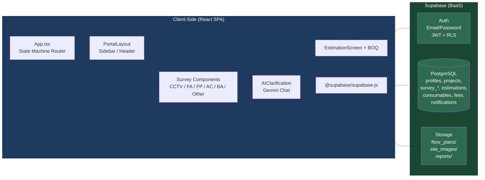

# AA2000 Site Survey

Site survey and estimation platform for electronic security systems (CCTV, Fire Alarm, Access Control, Burglar Alarm, Fire Protection, and more). Built with React + TypeScript on the frontend and Supabase as the backend.

## Tech Stack

| Category | Technology |
|----------|-----------|
| Framework | React 19, TypeScript |
| Build | Vite 6 |
| Styling | Tailwind CSS 4, Framer Motion |
| Backend | Supabase (Auth, Postgres, Storage, Edge Functions) |
| AI | Google Gemini (@google/genai) |
| Documents | jsPDF, html2canvas, docx |
| Maps | Leaflet |

## Prerequisites

- Node.js 18+
- A Supabase project
- A Google Gemini API key

## Getting Started

1. **Clone the repo**

2. **Install dependencies**
   ```bash
   npm install
   ```

3. **Configure environment variables** — copy `.env.example` to `.env.local` and fill in:
   ```env
   VITE_SUPABASE_URL=your_supabase_project_url
   VITE_SUPABASE_ANON_KEY=your_supabase_anon_key
   GEMINI_API_KEY=your_gemini_api_key
   ```

4. **Run database migrations** — execute the SQL in `supabase/migrations/` against your Supabase project (via Dashboard SQL editor or CLI).

5. **Start the dev server**
   ```bash
   npm run dev
   ```
   The app runs at `http://localhost:3002`.

## Scripts

| Script | Description |
|--------|-------------|
| `npm run dev` | Start Vite dev server (port 3002) |
| `npm run build` | Production build |
| `npm run preview` | Preview production build |
| `npm run lint` | TypeScript type checking |

---

## Architecture

### Architecture Diagram



### Client-Side Layers

| Layer | Files | Role |
|-------|-------|------|
| **State & Routing** | `App.tsx` | Custom state machine routing (20+ screens), URL sync via `history.pushState`/`popstate`, global state buffers |
| **Layout** | `PortalLayout.tsx` | Sidebar navigation, top header, theme toggling, notification bell |
| **Auth** | `Login.tsx`, `AdminLogin.tsx`, `Signup.tsx` | Supabase Auth email/password sign-in/sign-up |
| **Dashboard** | `Dashboard.tsx` | Project list (ongoing/upcoming/history), accept/decline, search/filter |
| **Project** | `ProjectDetails.tsx` | Create/edit project, set scope, assign technicians |
| **Surveys** | `CCTVSurvey.tsx`, `FireAlarmSurvey.tsx`, `AccessControlSurvey.tsx`, `BurglarAlarmSurvey.tsx`, `FireProtectionSurvey.tsx`, `OtherSurvey.tsx`, `IntercomServiceSurveyForm.tsx` | System-specific data collection with floor plan upload |
| **AI** | `AIClarification.tsx`, `geminiService.ts` | Gemini-powered chat for audit questions and narrative generation |
| **Estimation** | `EstimationScreen.tsx`, `BOQ.tsx` | Manpower breakdown, consumables, site constraints, cost calculation, DOCX/PDF generation |
| **Summary** | `SurveySummary.tsx`, `CurrentProjects.tsx` | Final review, approval/rejection, finalized report export |
| **Services** | `src/services/` | Supabase client, Gemini API, Geo location |
| **Utils** | `src/utils/` | Mean pricing calculators, consumable defaults, PDF export, notifications, voice processing |

---

## Database Schema

### Tables

```sql
-- Users & roles (managed by Supabase Auth + profiles table)
CREATE TABLE profiles (
  id          UUID PRIMARY KEY REFERENCES auth.users(id),
  email       TEXT NOT NULL,
  full_name   TEXT NOT NULL,
  role        TEXT NOT NULL CHECK (role IN ('technician', 'admin')),
  phone       TEXT,
  created_at  TIMESTAMPTZ DEFAULT now()
);

-- Projects
CREATE TABLE projects (
  id                    UUID PRIMARY KEY DEFAULT gen_random_uuid(),
  name                  TEXT NOT NULL,
  client_name           TEXT NOT NULL,
  client_contact_name   TEXT,
  client_email          TEXT,
  client_contact        TEXT,
  location              TEXT,
  location_name         TEXT,
  building_info         JSONB,
  project_survey_types  TEXT[],
  assigned_technicians  JSONB[],
  technician_responses  JSONB,
  status                TEXT DEFAULT 'In Progress',
  finalization          JSONB,
  start_date            DATE,
  end_date              DATE,
  created_by            UUID REFERENCES profiles(id),
  created_at            TIMESTAMPTZ DEFAULT now(),
  completed_at          TIMESTAMPTZ,
  completed_by          TEXT
);

-- Survey data per system (each uses JSONB for flexible nested data)
CREATE TABLE survey_cctv (
  id              UUID PRIMARY KEY DEFAULT gen_random_uuid(),
  project_id      UUID REFERENCES projects(id) ON DELETE CASCADE,
  building_info   JSONB,
  measurements    JSONB,
  cameras         JSONB[],
  infrastructure  JSONB,
  control_room    JSONB,
  created_at      TIMESTAMPTZ DEFAULT now(),
  updated_at      TIMESTAMPTZ DEFAULT now()
);

-- (Similar structure for: survey_fire_alarm, survey_access_ctrl,
--  survey_burglar, survey_fire_prot, survey_other)

-- Estimations
CREATE TABLE estimations (
  id                UUID PRIMARY KEY DEFAULT gen_random_uuid(),
  project_id        UUID REFERENCES projects(id) ON DELETE CASCADE,
  survey_type       TEXT NOT NULL,
  days              INTEGER,
  techs             INTEGER,
  manpower_breakdown JSONB[],
  site_constraints  JSONB,
  created_at        TIMESTAMPTZ DEFAULT now(),
  updated_at        TIMESTAMPTZ DEFAULT now()
);

CREATE TABLE consumables (
  id            UUID PRIMARY KEY DEFAULT gen_random_uuid(),
  estimation_id UUID REFERENCES estimations(id) ON DELETE CASCADE,
  name          TEXT NOT NULL,
  category      TEXT,
  qty           INTEGER,
  unit_price    NUMERIC
);

CREATE TABLE additional_fees (
  id            UUID PRIMARY KEY DEFAULT gen_random_uuid(),
  estimation_id UUID REFERENCES estimations(id) ON DELETE CASCADE,
  type          TEXT NOT NULL,
  amount        NUMERIC
);

CREATE TABLE notifications (
  id          UUID PRIMARY KEY DEFAULT gen_random_uuid(),
  user_id     UUID REFERENCES profiles(id),
  kind        TEXT NOT NULL,
  project_id  UUID REFERENCES projects(id),
  read        BOOLEAN DEFAULT false,
  created_at  TIMESTAMPTZ DEFAULT now()
);
```

### Row-Level Security (RLS)

```sql
-- Profiles: users read/edit their own; admins read all
CREATE POLICY "users_read_own_profile" ON profiles
  FOR SELECT USING (auth.uid() = id);
CREATE POLICY "admins_read_all_profiles" ON profiles
  FOR SELECT USING (auth.uid() IN (SELECT id FROM profiles WHERE role = 'admin'));

-- Projects: techs see assigned; admins see all
CREATE POLICY "technician_read_assigned" ON projects
  FOR SELECT USING (
    auth.uid() IN (
      SELECT id FROM profiles
      WHERE email = ANY (
        SELECT jsonb_array_elements_text(assigned_technicians::jsonb)::jsonb->>'email'
      )
    )
  );
CREATE POLICY "admin_all_projects" ON projects
  FOR ALL USING (
    auth.uid() IN (SELECT id FROM profiles WHERE role = 'admin')
  );

-- Survey tables: techs CRUD assigned projects; admins all
CREATE POLICY "technician_survey_access" ON survey_cctv
  FOR ALL USING (
    project_id IN (
      SELECT id FROM projects WHERE auth.uid() IN (
        SELECT id FROM profiles
        WHERE email = ANY (
          SELECT jsonb_array_elements_text(assigned_technicians::jsonb)::jsonb->>'email'
        )
      )
    )
  );
CREATE POLICY "admin_survey_access" ON survey_cctv
  FOR ALL USING (
    auth.uid() IN (SELECT id FROM profiles WHERE role = 'admin')
  );
```

---

## Workflow Flowchart


---

## Storage

| Bucket | Visibility | Contents |
|--------|-----------|----------|
| `floor_plans` | Private (RLS) | Floor plan images uploaded during surveys |
| `site_images` | Private (RLS) | Site photos taken during inspection |
| `reports` | Private (RLS) | Generated PDF/DOCX estimation reports |

---

## File Structure

```
src/
├── components/           # React components (screens, layouts)
│   ├── App.tsx           # Root: state machine router
│   ├── PortalLayout.tsx  # Sidebar + header shell
│   ├── Dashboard.tsx     # Main workspace hub
│   ├── Login.tsx         # Technician auth
│   ├── AdminLogin.tsx    # Admin auth
│   ├── Signup.tsx        # Registration
│   ├── ProjectDetails.tsx  # Project creation/editing
│   ├── CCTVSurvey.tsx      # (and 5+ other survey forms)
│   ├── EstimationScreen.tsx # Cost estimation
│   └── SurveySummary.tsx    # Final review
├── services/
│   ├── supabase.ts       # Supabase client init
│   ├── geminiService.ts  # Gemini API wrapper
│   └── summaryAccess.ts
├── utils/                # Pricing calculators, PDF export, helpers
├── hooks/                # Custom React hooks
├── types.ts              # TypeScript interfaces
├── constants.tsx         # Branding, enums
└── main.tsx              # Entry point
```
