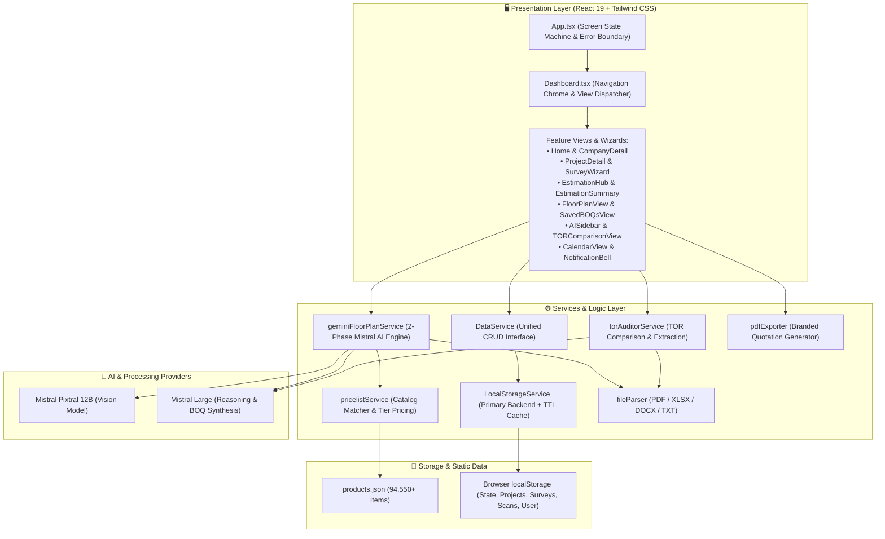
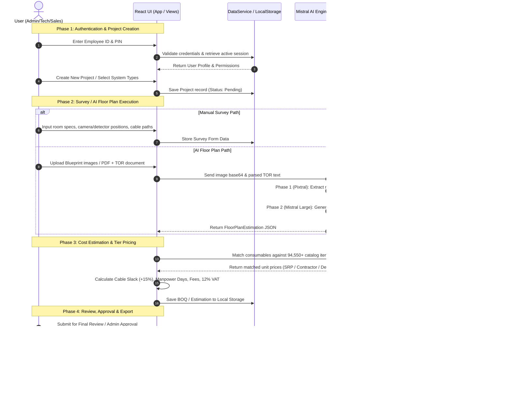
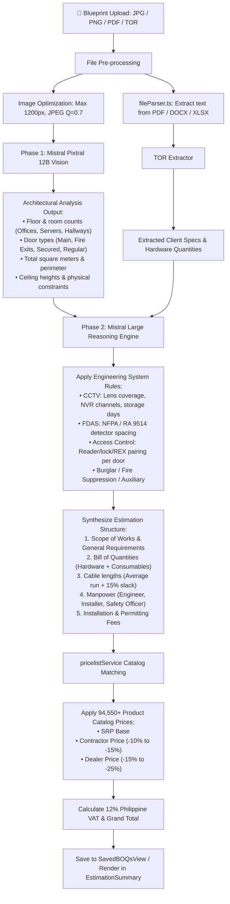
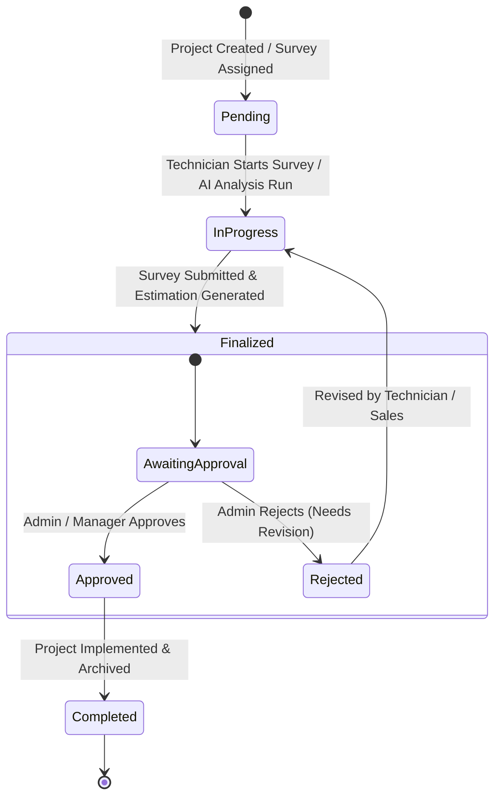
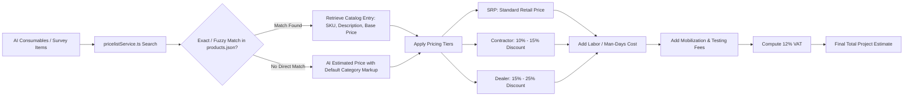

# AA2000 Estimation Hub — Site Survey & Estimation Platform

An enterprise-grade site survey, floor plan analysis, and automated Bill of Quantities (BOQ) estimation platform designed for electronic security and life safety engineering systems (CCTV, Fire Alarm/FDAS, Access Control, Burglar Alarm, Fire Protection, and auxiliary systems) in the Philippines.

Built with **React 19**, **TypeScript**, **Tailwind CSS**, and powered by a multi-model **Mistral AI Vision & Reasoning Pipeline** with an integrated product catalog of 94,550+ items.

---

## Table of Contents

- [Overview](#overview)
- [Tech Stack](#tech-stack)
- [System Architecture](#system-architecture)
- [Data Flow Diagrams](#data-flow-diagrams)
  - [1. End-to-End System Data Flow](#1-end-to-end-system-data-flow)
  - [2. AI Floor Plan & Document Estimation Pipeline](#2-ai-floor-plan--document-estimation-pipeline)
  - [3. Project Lifecycle & Approval State Machine](#3-project-lifecycle--approval-state-machine)
  - [4. Product Catalog Matching & Multi-Tier Pricing Flow](#4-product-catalog-matching--multi-tier-pricing-flow)
- [How the App Works (Step-by-Step Guide)](#how-the-app-works-step-by-step-guide)
  - [Step 1: Authentication & Role-Based Access](#step-1-authentication--role-based-access)
  - [Step 2: Dashboard & Project Management](#step-2-dashboard--project-management)
  - [Step 3: Creating New Projects & Survey Forms](#step-3-creating-new-projects--survey-forms)
  - [Step 4: Executing Multi-Step Site Surveys](#step-4-executing-multi-step-site-surveys)
  - [Step 5: AI Floor Plan Analysis & Vision Extraction](#step-5-ai-floor-plan-analysis--vision-extraction)
  - [Step 6: AI Document Reader & TOR Compliance Audit](#step-6-ai-document-reader--tor-compliance-audit)
  - [Step 7: Automated Estimation & BOQ Calculation](#step-7-automated-estimation--boq-calculation)
  - [Step 8: Review, Approvals & Lifecycle Progression](#step-8-review-approvals--lifecycle-progression)
  - [Step 9: Professional PDF Quotation Export](#step-9-professional-pdf-quotation-export)
  - [Step 10: Floating AI Assistant & Productivity Tools](#step-10-floating-ai-assistant--productivity-tools)
- [Key Features](#key-features)
- [Directory & Component Structure](#directory--component-structure)
- [Data Storage & Local Cache Keys](#data-storage--local-cache-keys)
- [Getting Started](#getting-started)
  - [Prerequisites](#prerequisites)
  - [Installation & Development](#installation--development)
  - [Environment Variables](#environment-variables)
  - [Building for Production](#building-for-production)

---

## Overview

AA2000 Estimation Hub streamlines the entire engineering pre-sales and project estimation lifecycle:
1. **On-Site Field Surveys**: Technicians capture structural, electrical, and physical site parameters via responsive, system-specific forms.
2. **Automated AI Plan Reading**: Upload CAD floor plans, blueprints, and TOR (Terms of Reference) files to extract architectural counts and auto-generate detailed equipment requirements.
3. **Instant Quotation Generation**: Generates accurate BOQ quotations with materials, labor/man-days, consumables, project fees, tiered pricing (SRP, Contractor, Dealer), and 12% Philippine VAT.
4. **Lifecycle & Approval Workflows**: Comprehensive status tracking (`Pending` → `In Progress` → `Finalized` → `Approved`/`Rejected` → `Completed`) with automated notifications and team assignment.

---

## Tech Stack

| Layer | Technologies |
|---|---|
| **Core Framework** | React 19, TypeScript 5.7 |
| **Build & Dev Tooling** | Vite 6 |
| **Styling & Design** | Tailwind CSS 4, Glassmorphism, Micro-animations |
| **Animations** | Framer Motion |
| **AI Vision & Reasoning** | Mistral API (`pixtral-12b-2409` for visual parsing, `mistral-large-latest` for BOQ synthesis, `mistral-small-latest` for TOR audits) |
| **Document Parsing** | `pdfjs-dist` (PDF), `xlsx` (Excel), `mammoth` (DOCX), plain text parser |
| **Product Database** | Local JSON Catalog (94,550+ SKU entries with SRP, Contractor, and Dealer pricing tiers) |
| **Primary Persistence** | Browser `localStorage` with unified `DataService` abstraction and TTL caching |
| **PDF Generation** | `html2pdf.js` with AA2000 enterprise branding, quotations, and sign-offs |
| **Deployment** | Vercel |

---

## System Architecture

The application adopts a modular, service-driven architecture that decouples UI rendering, business logic, AI pipelines, and persistence.


```mermaid
graph TB
    subgraph UI_Layer["🖥️ Presentation Layer (React 19 + Tailwind CSS)"]
        App["App.tsx (Screen State Machine & Error Boundary)"]
        Dashboard["Dashboard.tsx (Navigation Chrome & View Dispatcher)"]
        Views["Feature Views & Wizards:<br/>• Home & CompanyDetail<br/>• ProjectDetail & SurveyWizard<br/>• EstimationHub & EstimationSummary<br/>• FloorPlanView & SavedBOQsView<br/>• AISidebar & TORComparisonView<br/>• CalendarView & NotificationBell"]
    end

    subgraph Service_Layer["⚙️ Services & Logic Layer"]
        DS["DataService (Unified CRUD Interface)"]
        LSS["LocalStorageService (Primary Backend + TTL Cache)"]
        FPS["geminiFloorPlanService (2-Phase Mistral AI Engine)"]
        TORS["torAuditorService (TOR Comparison & Extraction)"]
        PLS["pricelistService (Catalog Matcher & Tier Pricing)"]
        FP["fileParser (PDF / XLSX / DOCX / TXT)"]
        PDF["pdfExporter (Branded Quotation Generator)"]
    end

    subgraph External_AI["🤖 AI & Processing Providers"]
        Pixtral["Mistral Pixtral 12B (Vision Model)"]
        MistralLarge["Mistral Large (Reasoning & BOQ Synthesis)"]
    end

    subgraph Storage_Layer["💾 Storage & Static Data"]
        Catalog["products.json (94,550+ Items)"]
        LocalStorage["Browser localStorage (State, Projects, Surveys, Scans, User)"]
    end

    App --> Dashboard
    Dashboard --> Views
    Views --> DS
    Views --> FPS
    Views --> TORS
    Views --> PDF

    DS --> LSS
    LSS --> LocalStorage

    FPS --> FP
    FPS --> Pixtral
    FPS --> MistralLarge
    FPS --> PLS

    TORS --> FP
    TORS --> MistralLarge

    PLS --> Catalog
```

---

## Data Flow Diagrams

### 1. End-to-End System Data Flow

This diagram illustrates how data flows between user interactions, application state, AI services, local storage, and export engines:


```mermaid
sequenceDiagram
    autonumber
    actor User as User (Admin/Tech/Sales)
    participant UI as React UI (App / Views)
    participant DS as DataService / LocalStorage
    participant AI as Mistral AI Engine (Pixtral + Large)
    participant Cat as Product Catalog (products.json)
    participant PDF as PDF Export Engine

    Note over User,UI: Phase 1: Authentication & Project Creation
    User->>UI: Enter Employee ID & PIN
    UI->>DS: Validate credentials & retrieve active session
    DS-->>UI: Return User Profile & Permissions
    User->>UI: Create New Project / Select System Types
    UI->>DS: Save Project record (Status: Pending)

    Note over User,UI: Phase 2: Survey / AI Floor Plan Execution
    alt Manual Survey Path
        User->>UI: Input room specs, camera/detector positions, cable paths
        UI->>DS: Store Survey Form Data
    else AI Floor Plan Path
        User->>UI: Upload Blueprint images / PDF + TOR document
        UI->>AI: Send image base64 & parsed TOR text
        AI->>AI: Phase 1 (Pixtral): Extract rooms, doors, perimeter, area
        AI->>AI: Phase 2 (Mistral Large): Generate BOQ using SYSTEM_RULES
        AI-->>UI: Return FloorPlanEstimation JSON
    end

    Note over User,UI: Phase 3: Cost Estimation & Tier Pricing
    UI->>Cat: Match consumables against 94,550+ catalog items
    Cat-->>UI: Return matched unit prices (SRP / Contractor / Dealer)
    UI->>UI: Calculate Cable Slack (+15%), Manpower Days, Fees, 12% VAT
    UI->>DS: Save BOQ / Estimation to Local Storage

    Note over User,UI: Phase 4: Review, Approval & Export
    User->>UI: Submit for Final Review / Admin Approval
    UI->>DS: Update Status (Finalized -> Approved)
    User->>UI: Click "Export PDF Quotation"
    UI->>PDF: Generate branded AA2000 multi-page PDF
    PDF-->>User: Download official Quotation document
```

---

### 2. AI Floor Plan & Document Estimation Pipeline

The two-phase AI pipeline transforms raw floor plan images and scope documents into standard engineering estimates:


```mermaid
flowchart TD
    A["📄 Blueprint Upload: JPG / PNG / PDF / TOR"] --> B["File Pre-processing"]
    B --> C1["Image Optimization: Max 1200px, JPEG Q=0.7"]
    B --> C2["fileParser.ts: Extract text from PDF / DOCX / XLSX"]

    C1 --> D1["Phase 1: Mistral Pixtral 12B Vision"]
    D1 --> E1["Architectural Analysis Output:<br/>• Floor & room counts (Offices, Servers, Hallways)<br/>• Door types (Main, Fire Exits, Secured, Regular)<br/>• Total square meters & perimeter<br/>• Ceiling heights & physical constraints"]

    C2 --> D2["TOR Extractor"]
    D2 --> E2["Extracted Client Specs & Hardware Quantities"]

    E1 --> F["Phase 2: Mistral Large Reasoning Engine"]
    E2 --> F

    F --> G["Apply Engineering System Rules:<br/>• CCTV: Lens coverage, NVR channels, storage days<br/>• FDAS: NFPA / RA 9514 detector spacing<br/>• Access Control: Reader/lock/REX pairing per door<br/>• Burglar / Fire Suppression / Auxiliary"]

    G --> H["Synthesize Estimation Structure:<br/>1. Scope of Works & General Requirements<br/>2. Bill of Quantities (Hardware + Consumables)<br/>3. Cable lengths (Average run + 15% slack)<br/>4. Manpower (Engineer, Installer, Safety Officer)<br/>5. Installation & Permitting Fees"]

    H --> I["pricelistService Catalog Matching"]
    I --> J["Apply 94,550+ Product Catalog Prices:<br/>• SRP Base<br/>• Contractor Price (-10% to -15%)<br/>• Dealer Price (-15% to -25%)"]

    J --> K["Calculate 12% Philippine VAT & Grand Total"]
    K --> L["Save to SavedBOQsView / Render in EstimationSummary"]
```

---

### 3. Project Lifecycle & Approval State Machine

Projects progress through a structured status lifecycle:


```mermaid
stateDiagram-v2
    [*] --> Pending: Project Created / Survey Assigned
    Pending --> InProgress: Technician Starts Survey / AI Analysis Run
    InProgress --> Finalized: Survey Submitted & Estimation Generated
    
    state Finalized {
        [*] --> AwaitingApproval
        AwaitingApproval --> Approved: Admin / Manager Approves
        AwaitingApproval --> Rejected: Admin Rejects (Needs Revision)
    }

    Rejected --> InProgress: Revised by Technician / Sales
    Approved --> Completed: Project Implemented & Archived
    Completed --> [*]
```

---

### 4. Product Catalog Matching & Multi-Tier Pricing Flow


```mermaid
flowchart LR
    A["AI Consumables / Survey Items"] --> B["pricelistService.ts Search"]
    B --> C{"Exact / Fuzzy Match in products.json?"}
    C -->|Match Found| D["Retrieve Catalog Entry: SKU, Description, Base Price"]
    C -->|No Direct Match| E["AI Estimated Price with Default Category Markup"]

    D --> F["Apply Pricing Tiers"]
    E --> F
    F --> G1["SRP: Standard Retail Price"]
    F --> G2["Contractor: 10% - 15% Discount"]
    F --> G3["Dealer: 15% - 25% Discount"]

    G1 --> H["Add Labor / Man-Days Cost"]
    G2 --> H
    G3 --> H
    H --> I["Add Mobilization & Testing Fees"]
    I --> J["Compute 12% VAT"]
    J --> K["Final Total Project Estimate"]
```

---

## How the App Works (Step-by-Step Guide)

### Step 1: Authentication & Role-Based Access
- Users log in using their **Employee ID** and **6-digit PIN** on `Login.tsx`.
- The system checks against hardcoded role configurations (OJT / Dev mode):
  - **ADMIN (`ADMIN` / `111111`)**: Full visibility across all projects, team assignment, survey review, estimate approval, and system settings.
  - **SALES (`SALES` / `111111`)**: Customer and project management, quotation generation, pipeline tracking, and client follow-ups.
  - **TECHNICIAN (`TECHNICIAN` / `111111`)**: On-site survey execution, workspace/todo list, floor plan capture, and submission for review.
- On first login, users view an interactive **Role Instruction Screen** (`InstructionScreen.tsx`) tailored to their permissions before landing on the dashboard.

### Step 2: Dashboard & Project Management
- The **Dashboard Hub** provides a centralized control tower:
  - **KPI Hero Banner**: Quick counts of Total Projects, Active Surveys, Pending Approvals, and Completed Installations.
  - **Quick Action Bar**: Role-adaptive shortcuts (e.g., *Start Survey*, *Floor Plan AI*, *New Project*, *Generate Quote*).
  - **Company Folders & Project Table**: Filter by client company, status tabs (*All*, *Pending*, *In Progress*, *Finalized*, *Completed*), or search by project name/reference.
  - **Interactive Calendar View**: Visualizes survey schedules, ongoing surveys, and deadlines.
  - **Notification Center**: Real-time alerts for overdue surveys, pending approvals, and missing requirements.

### Step 3: Creating New Projects & Survey Forms
- Click **"New Survey"** or **"New Project"** to launch `CreateSurveyForm.tsx` or `CreateProjectModal.tsx`.
- Fill in the 4-step wizard:
  1. **Company & Project Identification**: Assign to an existing client folder or create a new client profile.
  2. **System Type Selection**: Select one or multiple systems (CCTV, Fire Alarm, Access Control, Burglar Alarm, Fire Protection, Door Lock, EAS, Parking Barrier, POS, etc.).
  3. **Client & Contact Information**: Contact person, email, phone number, and site address.
  4. **Site Geolocation**: Interactive map pin-picker or address lookup to log exact site coordinates.
- Saving creates a new record in `localStorage` under `aa2000_projects` with initial status `Pending`.

### Step 4: Executing Multi-Step Site Surveys
- Technicians select a project and launch `SurveyWizard.tsx`.
- The wizard dynamically adjusts its step hierarchy depending on the system type:
  - **CCTV Systems**: Building profile → Camera locations & lens types → Infrastructure/cabling runs → Review & submit.
  - **Fire Alarm (FDAS)**: Building info → Detection zones (smoke, heat, beam) → Control panel location & annunciators → Review & submit.
  - **Access Control**: Building info → Door count, electromagnetic locks & readers → Access controller & power supply → Review & submit.
  - **Burglar Alarm**: Building info → Sensors (PIR, magnetic contacts, glass break) → Control panel & sirens → Review & submit.
  - **Fire Protection**: Building info → Suppression cylinders, nozzles, agent calculations → Review & submit.
- Form inputs automatically calculate recommended cable lengths, power supplies, and accessories in real-time.

### Step 5: AI Floor Plan Analysis & Vision Extraction
- Navigate to **Estimation Hub** → **"Floor Plan AI"** (`FloorPlanView.tsx`).
- Upload one or more architectural floor plan files (JPG, PNG, PDF) and optional project specifications/TOR.
- The system executes a two-phase AI pipeline via `geminiFloorPlanService.ts`:
  1. **Phase 1 (Mistral Pixtral Vision)**: Identifies rooms, partition walls, doors, perimeter, ceiling heights, and potential device placement points.
  2. **Phase 2 (Mistral Large)**: Synthesizes visual data with standard Philippine electrical and fire safety rules (`SYSTEM_RULES`) to calculate required device quantities, cable runs (with 15% slack), and required manpower.
- Results appear in an interactive preview with an AI Confidence Score.

### Step 6: AI Document Reader & TOR Compliance Audit
- Technicians and Sales can open the **AI Document Reader** (`AISidebar.tsx` / `TORComparisonView.tsx`).
- Upload Terms of Reference (TOR), Scopes of Work (SOW), or Request for Quotation (RFQ) files (PDF, DOCX, XLSX).
- `torAuditorService.ts` extracts required line items, validates hardware counts against the generated BOQ, and highlights any missing specifications, compliance risks, or discrepancies.

### Step 7: Automated Estimation & BOQ Calculation
- Open `EstimationSummary.tsx` to view the comprehensive cost breakdown:
  - **General Requirements**: Mobilization, demobilization, site safety, and permitting.
  - **Scope of Works**: Detailed engineering description per system type.
  - **Bill of Quantities (BOQ)**: Hardware and consumables matched against `products.json` catalog items.
  - **Pricing Tier Toggle**: Switch instantly between **SRP**, **Contractor Price**, and **Dealer Price**.
  - **Labor & Manpower**: Auto-calculated based on project duration (Lead Engineer, Senior Installer, Safety Officer, Tech Assistant).
  - **Tax & Grand Total**: Computes standard 12% VAT, discounts, and itemized milestone payment schedules.

### Step 8: Review, Approvals & Lifecycle Progression
- Technicians submit completed surveys for managerial review (status changes to `Finalized`).
- Administrators access the **Approval Pipeline** (`Dashboard.tsx` filtered by status):
  - Review survey answers, AI observations, and generated BOQ.
  - Click **"Approve"** to lock the estimation and mark as `Finalized - Approved`.
  - Click **"Reject"** with feedback notes to send it back to `In Progress` for revision.
- Once approved and deployed, projects transition to `Completed`.

### Step 9: Professional PDF Quotation Export
- Click **"Export PDF"** on any approved estimate or survey report.
- `pdfExporter.ts` formats the data into an official AA2000 multi-page quotation:
  - AA2000 corporate header and quotation reference numbering.
  - Client details, project site, and validity period.
  - Scope of work narrative and device summaries.
  - Formatted BOQ table with unit pricing and extended totals.
  - Milestone payment schedule and terms & conditions.
  - Formal sign-off and approval signature blocks.

### Step 10: Floating AI Assistant & Productivity Tools
- **Floating AI Assistant (`AIChatbotFloating.tsx`)**: Available across all screens to answer technical security questions, recommend cable gauges, calculate NFPA detector spacing, or explain price tier rules.
- **Survey Calendar (`CalendarView.tsx`)**: Displays site visits, scheduled surveys, and pending submission deadlines.
- **Missing Requirements Detector**: Flags projects that lack scheduled dates, key client info, or survey forms.
- **Search & Filter Engine**: Rapidly locates projects by company name, system type, status, or date range.

---

## Key Features

- **14+ System Types Supported**: CCTV, FDAS, Access Control, Burglar Alarm, Fire Protection, Smart Door Locks, EAS Anti-Theft, Parking Barriers, POS Systems, Room Alert, Public Address, PABX, Structure Cabling, and Custom Auxiliary.
- **Dual AI Engine**: Combines Vision (`pixtral-12b-2409`) and Reasoning (`mistral-large-latest`) for reliable, automated floor plan estimation.
- **Massive 94,550+ Product Catalog**: Direct matching with real-world SRP, contractor, and dealer pricing tiers.
- **Zero Configuration Local Storage**: Operates entirely within the browser with robust offline-friendly caching and state restoration.
- **Multi-Role Workflows**: Tailored UI, color schemes, and permission scopes for Admins, Managers, Sales, and Field Technicians.
- **Automated Document Compliance**: In-depth comparison between client Terms of Reference (TOR) and the generated BOQ.
- **Enterprise PDF Generation**: Clean, branded, print-ready engineering quotations and site survey summaries.

---

## Directory & Component Structure

```
AA2000 Estimation Hub/
├── api/                       # Optional serverless functions / API proxy
├── database/                  # Schema definitions & database scripts
├── pricelist/                 # Raw price list sources
├── public/                    # Static assets & favicon
├── src/
│   ├── components/
│   │   ├── ai-sidebar/        # AI Document Reader, TOR Comparison, Scan Folders
│   │   ├── auth/              # Login.tsx, InstructionScreen.tsx
│   │   ├── chatbot/           # AIChatbotFloating.tsx
│   │   ├── dashboard/         # Dashboard.tsx, Home.tsx, Sidebar.tsx, CalendarView.tsx
│   │   ├── estimation/        # EstimationHub.tsx, EstimationSummary.tsx, CreateSurveyForm.tsx
│   │   ├── floor-plan/        # FloorPlanView.tsx, SavedBOQsView.tsx
│   │   ├── notifications/     # NotificationBell.tsx
│   │   ├── projects/          # ProjectDetail.tsx, CompanyDetail.tsx, CreateProjectModal.tsx
│   │   ├── reports/           # SurveySummary.tsx
│   │   ├── settings/          # Settings.tsx
│   │   ├── surveys/           # SurveyWizard.tsx (CCTV, FDAS, Access, etc.)
│   │   └── utils/             # ErrorBoundary, Toast, LoadingSpinner
│   ├── config/                # App configuration constants
│   ├── constants/             # Roles.ts (Credentials, Permissions, Statuses)
│   ├── data/                  # products.json (94,550+ product catalog)
│   ├── services/
│   │   ├── api/               # ApiClient (HTTP fetch wrapper with timeout)
│   │   ├── local-storage/     # LocalStorageService (CRUD + TTL caching)
│   │   ├── supabase/          # SupabaseService (configured via factory)
│   │   ├── factory.ts         # DataService factory (defaults to localStorage)
│   │   ├── fileParser.ts      # Multi-format document parser (PDF, XLSX, DOCX)
│   │   ├── geminiFloorPlanService.ts # 2-phase Mistral AI vision & BOQ pipeline
│   │   ├── pricelistService.ts # Catalog search & tier pricing calculations
│   │   └── torAuditorService.ts # TOR specification compliance auditor
│   ├── types/                 # TypeScript interfaces (Survey, Project, Estimation)
│   ├── utils/                 # Icons.tsx, pdfExporter.ts, RoleTheme.ts, validation.ts
│   ├── App.tsx                # Master screen state machine & global error handling
│   └── main.tsx               # Vite entry point
├── package.json
├── tsconfig.json
├── vite.config.ts
└── README.md
```

---

## Data Storage & Local Cache Keys

All application data is managed through `LocalStorageService` with automatic TTL cache management:

| Storage Key | Data Structure | Purpose |
|---|---|---|
| `aa2000_projects` | `Project[]` | Master repository of all projects and metadata |
| `aa2000_surveys` | `Record<string, SurveyData>` | Detailed survey form submissions indexed by project ID |
| `aa2000_user` | `UserCredential` | Currently authenticated user session |
| `aa2000_ai_scans` | `AIScanGroup[]` | Saved AI floor plan scans, extracted specs, and BOQs |
| `aa2000_notifications` | `AppNotification[]` | Auto-derived and custom notification records |
| `aa2000_pinned` | `string[]` (JSON set) | Pinned project and company folder IDs |
| `aa2000_has_seen_instruction` | `boolean` | Flag indicating if user completed the role walkthrough |
| `aa2000_app_version` | `string` | Version control tracker (`aa2000_v5`) |
| `aa2000_cache_*` | `CachedItem<T>` | TTL cached queries (5-minute expiration) |

---

## Getting Started

### Prerequisites

- **Node.js**: Version 18.x or higher (Node 20+ recommended)
- **npm**: Version 9.x or higher
- **Mistral API Key**: Required for AI Floor Plan and Document Reader capabilities

### Installation & Development

1. **Clone the repository and navigate to the project directory**:
   ```bash
   cd "AA2000 Estimation Hub"
   ```

2. **Install dependencies**:
   ```bash
   npm install
   ```

3. **Configure environment variables**:
   Create a `.env` file in the project root (see [Environment Variables](#environment-variables)):
   ```env
   VITE_MISTRAL_API_KEY=your_mistral_api_key_here
   ```

4. **Start the development server**:
   ```bash
   npm run dev
   ```
   The application will be accessible at `http://localhost:3000` (and on your local network IP).

### Environment Variables

| Variable | Description | Required |
|---|---|---|
| `VITE_MISTRAL_API_KEY` | Mistral AI API key used for Pixtral vision & Mistral Large BOQ generation | **Yes** (for AI features) |
| `VITE_SUPABASE_URL` | Supabase project URL (optional, if switching storage backend) | No |
| `VITE_SUPABASE_ANON_KEY` | Supabase public anonymous API key (optional) | No |

### Building for Production

```bash
# Type check and build optimized bundle
npm run build

# Run linting checks
npm run lint

# Locally preview production build
npm run preview
```

The production output is generated in the `dist/` folder and is ready for static deployment on Vercel, Netlify, or any static hosting provider.

---

## License & Copyright

© 2026 AA2000 Security and Technology Solutions Inc. All rights reserved. Proprietary software for authorized engineering and estimation workflows.
