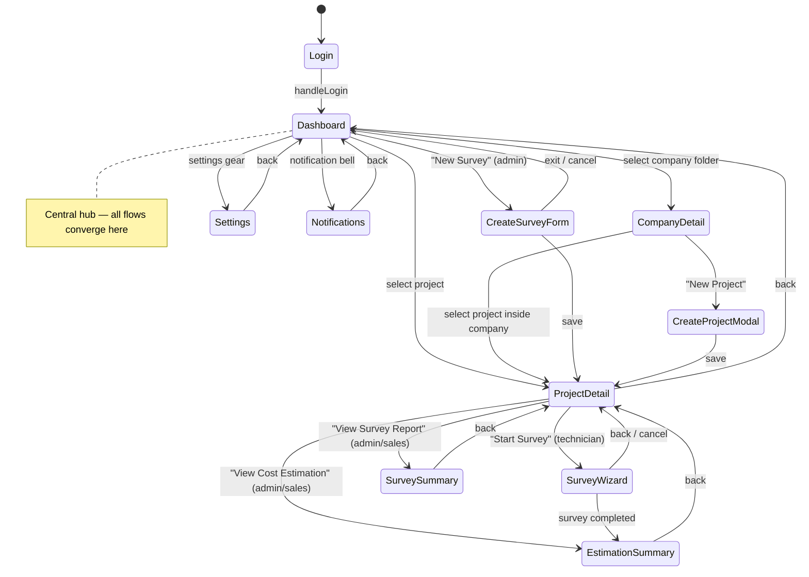
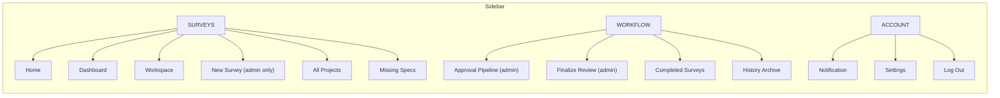
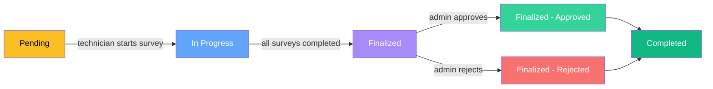
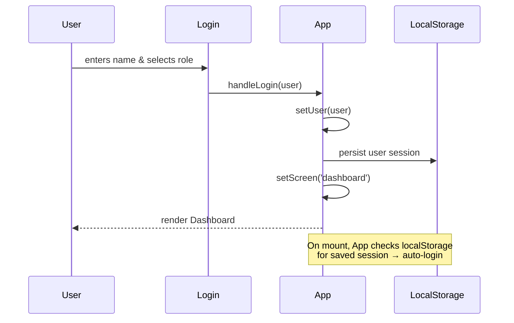
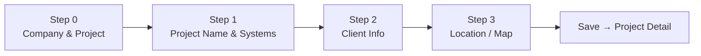
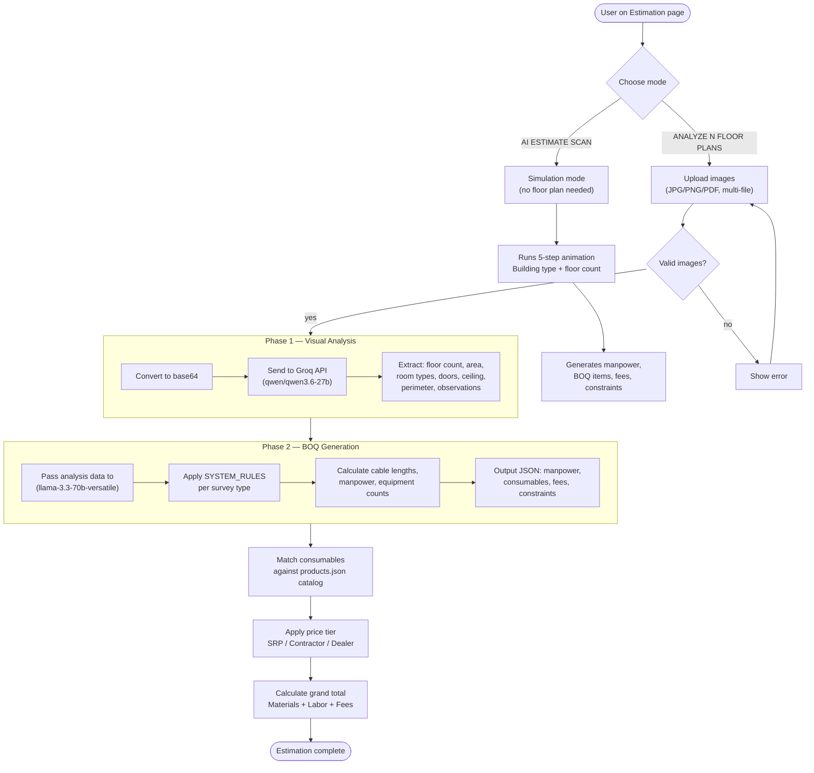
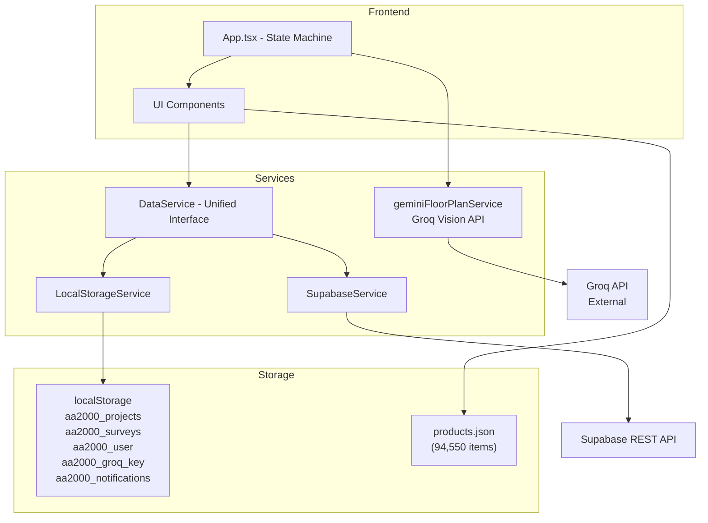

# AA2000 Site Survey — Architecture & Workflow

## Screen State Machine



## Navigation Sidebar



## Project Lifecycle



## Authentication Flow



## Survey Wizard — Per-Type Steps

```mermaid
flowchart TD
  subgraph CCTV
    CCTV1[Building Info] --> CCTV2[Cameras]
    CCTV2 --> CCTV3[Infrastructure]
    CCTV3 --> CCTV4[Review]
  end

  subgraph FIRE_ALARM
    FA1[Building Info] --> FA2[Detection Areas]
    FA2 --> FA3[Control Panel]
    FA3 --> FA4[Review]
  end

  subgraph ACCESS_CONTROL
    AC1[Building Info] --> AC2[Doors & Readers]
    AC2 --> AC3[Controller]
    AC3 --> AC4[Review]
  end

  subgraph BURGLAR_ALARM
    BA1[Building Info] --> BA2[Sensors]
    BA2 --> BA3[Control Panel]
    BA3 --> BA4[Review]
  end

  subgraph FIRE_PROTECTION
    FP1[Building Info] --> FP2[Suppression Systems]
    FP2 --> FP3[Review]
  end

  subgraph OTHER
    OT1[Building Info] --> OT2[Technical Specs]
    OT2 --> OT3[Review]
  end
```



### Create Survey Form (4-step standalone)



## AI Estimation Workflow



## Data Flow



## Component Hierarchy

```mermaid
graph TB
  APP["App.tsx<br/>(Screen Router & Global State)"]

  APP --> LOGIN["Login.tsx"]
  APP --> DASH["Dashboard.tsx"]
  APP --> CSF["CreateSurveyForm.tsx"]
  APP --> SETTINGS["Settings.tsx"]

  DASH --> SIDEBAR["Sidebar.tsx"]
  DASH --> HOME["Home.tsx"]
  DASH --> COMPANY["CompanyDetail.tsx"]
  DASH --> CPM["CreateProjectModal.tsx"]
  DASH --> NOTIF_BELL["NotificationBell.tsx"]

  COMPANY --> PROJ_DETAIL["ProjectDetail.tsx"]
  PROJ_DETAIL --> SURVEY_CARD["SurveyCard.tsx"]

  CSF --> MAP["LeafletMap.tsx"]
  CPM --> MAP

  APP --> SURVEY_WIZ["SurveyWizard.tsx"]
  SURVEY_WIZ --> BUILDING["BuildingForm"]
  SURVEY_WIZ --> CAMERA["CameraForm"]
  SURVEY_WIZ --> INFRA["CCTVInfraForm"]
  SURVEY_WIZ --> DETECT["DetectionForm"]
  SURVEY_WIZ --> DOOR["DoorForm"]
  SURVEY_WIZ --> SENSOR["SensorForm"]
  SURVEY_WIZ --> PANEL["PanelForm"]
  SURVEY_WIZ --> CONTROLLER["ControllerForm"]
  SURVEY_WIZ --> SUPPRESS["SuppressionForm"]
  SURVEY_WIZ --> SPECS["SpecsForm"]
  SURVEY_WIZ --> REVIEW["ReviewForm"]

  APP --> EST["EstimationSummary.tsx"]
  APP --> SUMMARY["SurveySummary.tsx"]
